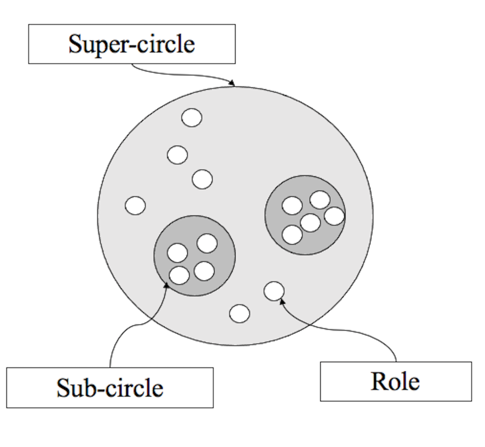
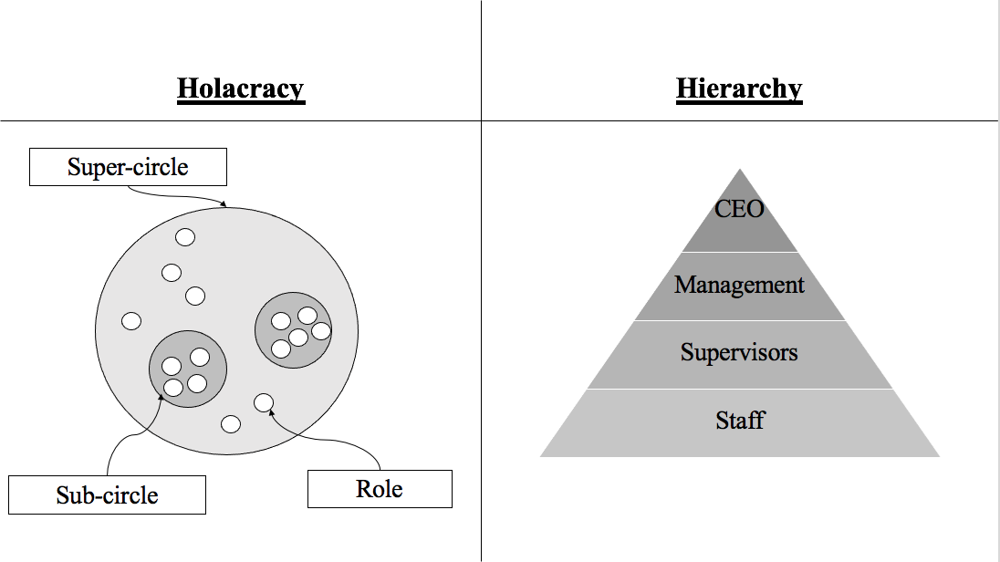

=======
# **Holacracy**
Philip Pauli & Gianna Höning-Kaprolat

Digital Organizations 

>>>>>>> 2f5539503105ace9e8afc13610bde33ade073da1
---

# Agenda 

1. What is Holacracy
2. xc
3. hjk
4. Holacracy vs. Bureaucracy 
5. History of Holacracy 
6. Disadvantages and Advantages 
7. The example of Zappos 

---

# What is **Holacracy** ?

* xc
* vb
* bhjj

---

# **Holacracy** vs **Bureaucracy** 

 

---

# History of **Holacracy** 

* ggh
* fgh
* dg

...

# Advantages and Disadvantages 

* ghj
* ghk
* rftzguio

---

# The company example of **Zappos** 

---

# 

