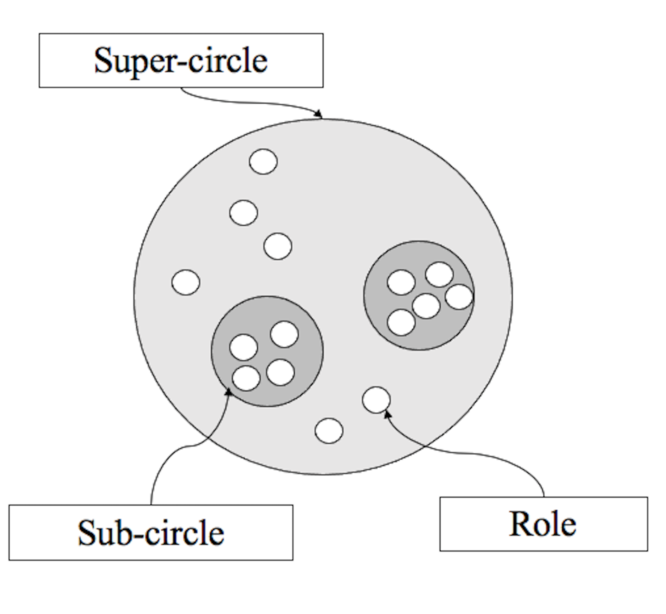
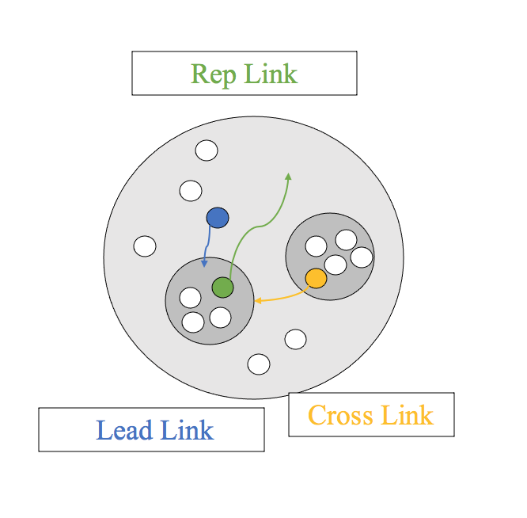

# **Holacracy**
Philip Pauli & Gianna Höning-Kaprolat

Digital Organizations 

---

 ## Agenda 

1. What is Holacracy?
2. The Concept
3. Characteristics 
4. Main Principles 
5. History of Holacracy 
6. Advantages and Disadvantages
7. The example of Zappos 
8. Key Points

---

## 1. What is Holacracy ?

**“is a means of organizing which in every way surpasses conventional norms"**

* Practice/model/social technology for governing and operating organizations, individuals and groups
* Replaces artificial hierarchy with fractal holarchy of self-organizing teams 

---

 
---

* Super-circle: top entity
* Sub-circles are formed, when need arise 
* Roles are appointed to sub-cricles 

---

---

* Super-circles and sub-circles are connected via two special roles 
* Allow exchange of infomartion across circle boundaries 
* Different kinds of links 

---

## 2.The Concept 
* Based on non-hierarchic management model 
* Redistribution of authority based on defined roles 
* Meetings to ensure harmony and productivity within the team(s)

---

## 3.Characteeristics 
* Horizontal specialization 
* Selective decentralization within and among teams 
* Adjustment as basis of cooperation 
* Grouping specialists into functional units 

---

## 4.Main principles 
* Dynamic planning 
* Interactive organizational learning 
* Integrative decision-making 

---
## 5.Histrory of Holacracy 
* New model, which integrates several existing models
* Redefined sociocracy
* Many incorporated ideas can be found in philisophy and psychology

---

## 6.Advantages 

* Increased adaptability to opportunities and threats 
* Peer-to-peer governance 
* Employees not limited by hierarchical structures 
* Opportunities and threats are observed on a daily basis 
* Open exchange of opinions and information 

---

## 6.Disadvanatges 

* No clearly defined boundaries 
* Theorists claim: too flat and chaotic
* internal resistance (employees & management)
* Flat structures: mostly only convenient at a company's young age
* No feeling of safety like in hierarchic organizations

---

 

---
## 7.The company example of **Zappos** 
 
 * Large, well-established and positioned company 
 * Problem: execution of power and authority, bureaucracy 
 * Strategy change: from sales volume to satisfaction
 * Goal: increase adaptabioity, creativity, engegament, teamwork and transparency 
---

Problems
* Some negative responses
* Fears connceted to the absence of hierarchy 
* Boycott
* Old behavioral patterns

---

Still tendencies to hierarchic patterns, but
* shift of focus on corporate culture 
* shift of traditional control patterns 

---
## 8. Key Points 

* Provides and promotes flexibility, transparency and adequate decision-making 
* Sets a clear purpose, to be fulfilled by self-organizing teams and the distribution of responsibility and authority 
* To be successful: needs full support of all participants 

---

---

## References 

Krasula, N. et al. (2016). Holacracy - The new management sytsem. retrieved 10.10.2020 from http://isc2016.ekonomskifakultet.rs/ISCpdfs/ISC2016-19.pdf

Robertson, B. J. (2007). Organizations at the leading edge: Introducing Holacracy. Retrieved 20.09.2020 from http://gbds.us/clientuploads/downloads/Holacracy.pdf

---
Robertson, B. J. (2015). Holacracy - The new management system for a rapidly changing world. Henry Holt and Company New York. p.9, 40

Skorková, Z. et al. (2019). Is Holacracy bringing down hierarchy or is it only an appealing marketing slogan? EDAMBA 2019. p.461-469. Retrieved 10.10.2020 from https://edamba.euba.sk/www_write/files/archive/edamba2019_proceedings.pdf#page=474

